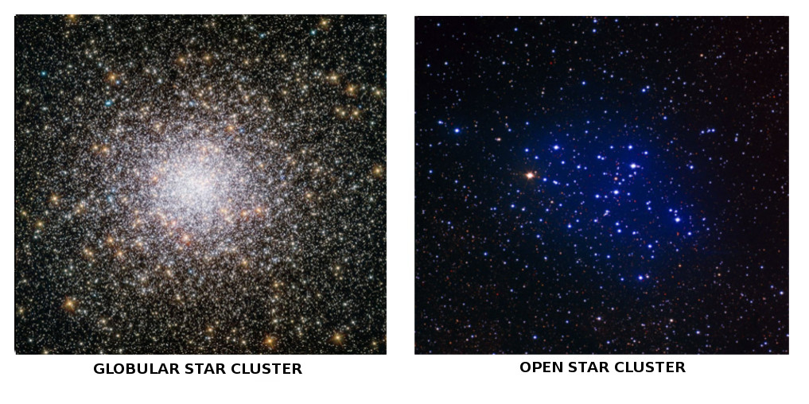
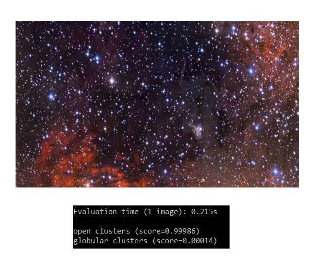
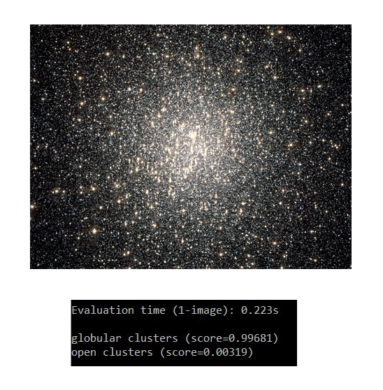

# Tensorflow Image Classifier: Globular vs Open Star Cluster

This is the repository developed for demonstrating _Transfer Learning_ with Convolutional Neural Networks like MobileNet and Inception.

Astronomers can use this classifier to automatically label whether an image taken by telescope is of a Globular Star Cluster or an Open Star Cluster.

## Requirements

- [Python v3.6](https://www.python.org/)
- [Tensorflow v1.8](https://www.tensorflow.org/)

## Usage 

1. Change directory structure for classification directories.

2. Retrain the model using _retrain.py_ and modifying the hyperparameters.

2. Run the _label_image.py_ to label the image. `python label_image.py <path_to_image>`

## Training

## Tensorboard Training Summaries

## Results
Model can successfully differentiate between image of a globular cluster and an open cluster. 

### Accuracy

### Test on Globular Star Cluster Image

### Test on Open Star Cluster Image

